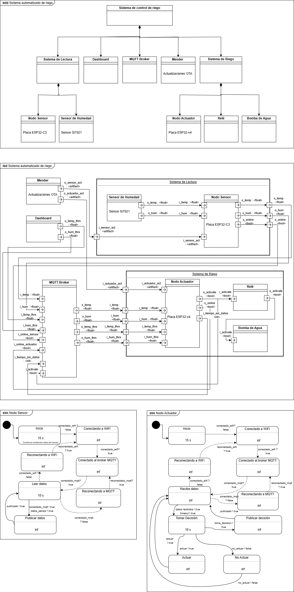

# Sistema Empotrado Distribuido de Riego Automático

Sistema de riego automático basado en ESP32 con monitoreo de temperatura y humedad, control remoto vía MQTT y actualizaciones OTA mediante Mender.

## Tabla de Contenidos

- [Descripción](#descripción)
- [Diagramas del Sistema](#diagramas-del-sistema)
  - [Diagrama de Bloques (BDD)](#diagrama-de-bloques-bdd)
  - [Diagrama de Bloques Interno (iBD)](#diagrama-de-bloques-interno-ibd)
  - [Máquina de Estados](#máquina-de-estados)
- [Requisitos Previos](#requisitos-previos)
- [Instalación y Configuración](#instalación-y-configuración)
  - [1. Preparación del Entorno](#1-preparación-del-entorno)
  - [2. Configuración de Credenciales WiFi](#2-configuración-de-credenciales-wifi)
  - [3. Instalación del Nodo Sensor](#3-instalación-del-nodo-sensor)
  - [4. Instalación del Nodo Actuador](#4-instalación-del-nodo-actuador)
  - [5. Configuración de Mender (OTA)](#5-configuración-de-mender-ota)
- [Conexiones de Hardware](#conexiones-de-hardware)
- [Node-RED](#node-red)
- [Solución de Problemas](#solución-de-problemas)
- [Estructura del Proyecto](#estructura-del-proyecto)
- [Tópicos MQTT Utilizados](#tópicos-mqtt-utilizados)
- [Enlace a Vídeo Demostrativo](#video-demostrativo)
- [Licencia](#licencia)
- [Autores](#autores)

- [Referencias](#referencias)

---

## Descripción

Este proyecto implementa un sistema empotrado distribuido de riego automático compuesto por dos nodos ESP32 que se comunican mediante MQTT. El nodo sensor monitorea temperatura y humedad con un sensor Si7021 y publica los datos al broker. El nodo actuador recibe esos datos, los compara con umbrales configurables y activa o desactiva la bomba de riego en consecuencia. Ambos nodos soportan actualizaciones Over-The-Air (OTA) mediante Mender y se visualizan desde un dashboard Node-RED.

| Componente | Modelo | Función |
|-----------|--------|---------|
| Nodo Sensor | ESP32-C3 | Lee temperatura y humedad (Si7021) y publica vía MQTT |
| Nodo Actuador | ESP32 | Controla el relé/bomba según umbrales recibidos por MQTT |
| Sensor | Si7021 (I2C) | Temperatura y humedad relativa |
| Broker MQTT | broker.hivemq.com | Comunicación entre nodos |
| Dashboard | Node-RED | Visualización y control remoto |
| OTA | Mender (eu.hosted.mender.io) | Actualizaciones de firmware remotas |

---

## Diagrama de Bloques del Sistema



---

## Requisitos Previos

### Software

- **ESP-IDF v5.5.3** (obligatorio)
- Python 3.8+
- Git
- Docker (para Node-RED)
- mender-artifact (para actualizaciones OTA)

### Hardware

- ESP32-C3 DevKit (nodo sensor)
- ESP32 DevKit (nodo actuador)
- Sensor Si7021 (temperatura y humedad I2C)
- Relé para el control de la bomba de agua
- Bomba de agua
- Cables de conexión y USB para programación

---

## Instalación y Configuración

### 1. Preparación del Entorno

#### Instalar ESP-IDF

```bash
# Si aún no tienes ESP-IDF instalado
cd ~/sed
git clone --recursive https://github.com/espressif/esp-idf.git
cd esp-idf
git checkout v5.5.3
./install.sh esp32,esp32c3
```

#### Cargar variables de entorno

```bash
source ~/sed/esp-idf/export.sh
```

> **Nota**: Este comando debe ejecutarse en cada nueva terminal antes de trabajar con el proyecto.

#### Verificar versión de ESP-IDF

```bash
idf.py --version
# Debe mostrar: ESP-IDF v5.5.3
```

---

### 2. Configuración de Credenciales WiFi

Cada nodo requiere configuración de credenciales WiFi y broker MQTT mediante `menuconfig`:

```bash
# Desde el directorio de cada nodo
idf.py menuconfig
```

Navega a las opciones de configuración del proyecto y configura:
- **SSID de WiFi**: Tu red WiFi
- **Contraseña WiFi**: Contraseña de tu red
- **Broker MQTT**: `broker.hivemq.com` (por defecto)

Los parámetros se definen en `main/Kconfig.projbuild` de cada nodo.

---

### 3. Instalación del Nodo Sensor

El nodo sensor utiliza un **ESP32-C3** y lee datos del sensor Si7021 vía I2C.

#### Paso 1: Navegar al directorio del proyecto

```bash
cd ~/sed/esp-workspace/auto-irrigation-system/sensor-node
```

#### Paso 2: Agregar dependencias del sensor

```bash
idf.py add-dependency "esp-idf-lib/si7021"
idf.py add-dependency "esp-idf-lib/i2cdev"
```

#### Paso 3: Configurar el target y los pines I2C

```bash
idf.py set-target esp32c3
idf.py menuconfig
```

En menuconfig, configura los pines I2C:
1. Navega a: **Component config → I2C Device Library**
2. Configura:
   - **Default I2C SDA pin**: `10`
   - **Default I2C SCL pin**: `8`

Guarda: `S` → `Q`

#### Paso 4: Compilar

```bash
idf.py build
```

#### Paso 5: Flashear y monitorear

```bash
# Conecta el ESP32-C3 al puerto USB
idf.py -p /dev/ttyACM0 flash monitor
```

> Verifica el puerto con `ls /dev/tty*`. Para salir del monitor: `Ctrl + ]`

---

### 4. Instalación del Nodo Actuador

El nodo actuador utiliza un **ESP32** estándar.

#### Paso 1: Navegar al directorio del proyecto

```bash
cd ~/sed/esp-workspace/auto-irrigation-system/actuator-node
```

#### Paso 2: Configurar el target

```bash
idf.py set-target esp32
```

#### Paso 3: Compilar

```bash
idf.py build
```

#### Paso 4: Flashear y monitorear

```bash
# Conecta el ESP32 al puerto USB
idf.py -p /dev/ttyUSB0 flash monitor
```

> Verifica el puerto con `ls /dev/tty*`. Para salir del monitor: `Ctrl + ]`

---

### 5. Configuración de Mender (OTA)

Mender permite actualizar el firmware de los dispositivos de forma remota (Over-The-Air).

#### Paso 1: Instalar herramientas

```bash
sudo apt update
sudo apt install mender-artifact docker-compose-v2
```

#### Paso 2: Descargar el cliente Mender MCU

Ejecuta esto en **cada proyecto** (sensor-node y actuator-node):

```bash
mkdir -p external/mender-mcu-client
git clone --branch 0.12.3 --recursive \
  https://github.com/joelguittet/mender-mcu-client.git \
  external/mender-mcu-client/
```

#### Paso 3: Editar CMakeLists.txt

Agrega la siguiente línea en el `CMakeLists.txt` raíz de cada proyecto, después de `cmake_minimum_required`:

```cmake
cmake_minimum_required(VERSION 3.16)

list(APPEND EXTRA_COMPONENT_DIRS "external/mender-mcu-client/esp-idf")

include($ENV{IDF_PATH}/tools/cmake/project.cmake)
project(sensor-node)  # o actuator-node según el proyecto
```

#### Paso 4: Crear archivo de particiones

El archivo `partitions.csv` debe existir en la raíz de cada proyecto con el siguiente contenido:

```csv
# Name,    Type,  SubType, Offset, Size,    Flags
nvs,      data,  nvs,           , 0x4000,
otadata,  data,  ota,           , 0x2000,
phy_init, data,  phy,           , 0x1000,
ota_0,    app,   ota_0,         , 1500K,
ota_1,    app,   ota_1,         , 1500K,
```

#### Paso 5: Configurar mediante menuconfig

```bash
idf.py menuconfig
```

| Sección | Opción | Valor |
|---------|--------|-------|
| Bootloader config → Application Rollback | Enable app rollback support | ✅ Activar |
| Serial Flasher Config → Flash size | Flash size | 4 MB |
| Partition Table → Partition Table | Partition Table | Custom partition table CSV |
| Partition Table → Custom partition CSV file | — | `partitions.csv` |
| Component config → Mender Firmware OTA → General Configuration | Mender server host URL | `https://eu.hosted.mender.io` |
| Component config → Mender Firmware OTA → General Configuration | Mender server Tenant Token | _(tu token)_ |
| Component config → ESP-TLS | Allow potentially insecure options | ✅ Activar |
| Component config → ESP-TLS | Skip server certificate verification by default | ✅ Activar |

> ⚠️ La configuración insegura de ESP-TLS es **solo para desarrollo**. En producción usa certificados válidos.

Guarda: `S` → `Q`

#### Paso 6: Recompilar con Mender

```bash
idf.py build
```

#### Paso 7: Crear artefactos Mender

**Nodo actuador:**

```bash
cd ~/sed/esp-workspace/auto-irrigation-system/actuator-node

mender-artifact write rootfs-image \
  --compression none \
  --device-type esp32 \
  --artifact-name a_1.0.2 \
  --file build/actuator-node.bin \
  --output-path a_1.0.2.mender
```

**Nodo sensor:**

```bash
cd ~/sed/esp-workspace/auto-irrigation-system/sensor-node

mender-artifact write rootfs-image \
  --compression none \
  --device-type esp32c3 \
  --artifact-name s_1.0.2 \
  --file build/sensor-node.bin \
  --output-path s_1.0.2.mender
```

Los archivos `.mender` se suben al servidor de Mender para distribuir las actualizaciones.

---

## Conexiones de Hardware

### Sensor Si7021 → ESP32-C3

| Pin Si7021 | Pin ESP32-C3 | Función |
|-----------|--------------|---------|
| VCC / VIN | 3V3 | Alimentación |
| GND | GND | Tierra |
| SDA | GPIO 10 | Datos I2C |
| SCL | GPIO 8 | Reloj I2C |

### Relé → ESP32
| Pin Relé | Pin ESP32 | Función |
|----------|-----------|---------|
| VCC | 3V3 | Alimentación del relé |
| GND | GND | Tierra |
| IN | GPIO 2 | Control del relé (bomba) |
---

## Node-RED

Node-RED proporciona un dashboard web para visualizar y controlar el sistema.

### Instalación de Docker

```bash
sudo apt update
sudo apt install docker.io
sudo usermod -aG docker $USER
# Cierra sesión y vuelve a iniciarla para aplicar los cambios de grupo
```

### Crear contenedor de Node-RED

```bash
mkdir -p ~/sed/node-red/data
cd ~/sed/node-red
docker run -it -p 1880:1880 -v ./data:/data --name mynodered nodered/node-red
```

### Gestión del contenedor

```bash
docker stop mynodered                  # Detener
docker start mynodered                 # Iniciar
docker logs --tail=100 -f mynodered    # Ver logs
```

### Acceder a Node-RED

| URL | Descripción |
|-----|-------------|
| http://127.0.0.1:1880/ | Editor de flujos |
| http://127.0.0.1:1880/dashboard/page2 | Dashboard de monitoreo |

> Importa el flujo desde `NodeRed-flows.json` en el editor (menú → Import).

---

## Solución de Problemas

### ESP32 no detectado

```bash
ls /dev/tty*                        # Verificar puertos disponibles
sudo chmod 666 /dev/ttyACM0         # Dar permisos (sensor)
sudo chmod 666 /dev/ttyUSB0         # Dar permisos (actuador)
```

### Error de compilación

```bash
idf.py fullclean
idf.py build
```

### Error de conexión WiFi

1. Verifica las credenciales en `idf.py menuconfig`
2. Asegúrate de que la red WiFi esté disponible
3. Revisa los logs con `idf.py monitor`

### Error de conexión MQTT

1. Verifica que tienes acceso a internet: `ping broker.hivemq.com`
2. Comprueba si el firewall bloquea el puerto 1883

### Errores de Mender (timeouts, TLS)

1. Verifica que ESP-TLS tiene habilitadas las opciones inseguras (solo desarrollo)
2. Comprueba que el tenant token de Mender es correcto
3. Asegúrate de que la hora del sistema está sincronizada (Mender valida certificados por fecha)

### Sensor Si7021 no responde

1. Verifica las conexiones hardware (SDA → GPIO 10, SCL → GPIO 8)
2. Verifica alimentación (3.3V, no 5V)
3. Revisa logs I2C con `idf.py monitor`

---

## Estructura del Proyecto

```
auto-irrigation-system/
├── README.md                        # Este archivo
├── NodeRed-flows.json               # Flujo de Node-RED
├── sensor-node/                     # Proyecto del nodo sensor (ESP32-C3)
│   ├── main/
│   │   ├── sensor-node.c            # Punto de entrada principal
│   │   ├── sensor_manager.c/h       # Lectura del Si7021 y publicación MQTT
│   │   ├── mqtt_manager.c/h         # Gestión de conexión y eventos MQTT
│   │   ├── ota_updates_manager.c/h  # Integración con Mender OTA
│   │   ├── wifi_manager.c/h         # Gestión de conexión WiFi
│   │   ├── Kconfig.projbuild        # Configuración de credenciales (WiFi/MQTT)
│   │   ├── idf_component.yml        # Dependencias del componente
│   │   └── CMakeLists.txt
│   ├── partitions.csv               # Tabla de particiones OTA
│   ├── external/
│   │   └── mender-mcu-client/       # Cliente Mender para MCU
│   └── CMakeLists.txt
└── actuator-node/                   # Proyecto del nodo actuador (ESP32)
    ├── main/
    │   ├── actuator-node.c          # Punto de entrada principal
    │   ├── actuator_manager.c/h     # Lógica de control del riego
    │   ├── mqtt_manager.c/h         # Gestión de conexión y eventos MQTT
    │   ├── ota_updates_manager.c/h  # Integración con Mender OTA
    │   ├── wifi_manager.c/h         # Gestión de conexión WiFi
    │   ├── Kconfig.projbuild        # Configuración de credenciales (WiFi/MQTT)
    │   ├── idf_component.yml        # Dependencias del componente
    │   └── CMakeLists.txt
    ├── partitions.csv               # Tabla de particiones OTA
    ├── external/
    │   └── mender-mcu-client/       # Cliente Mender para MCU
    └── CMakeLists.txt
```

---

## Tópicos MQTT Utilizados

| Tópico | Dirección | Descripción |
|--------|-----------|-------------|
| `sed/G03/auto-irrigation-system/status` | Sensor → Broker | Estado del sistema (LWT / Online) |
| `sed/G03/auto-irrigation-system/sensor/temp` | Sensor → Broker | Temperatura actual (°C) |
| `sed/G03/auto-irrigation-system/sensor/hum` | Sensor → Broker | Humedad relativa actual (%) |
| `sed/G03/auto-irrigation-system/actuator/temp` | Broker → Actuador | Umbral de temperatura (set-point) |
| `sed/G03/auto-irrigation-system/actuator/hum` | Broker → Actuador | Umbral de humedad (set-point) |
| `sed/G03/auto-irrigation-system/actuator/action` | Actuador → Broker | Acción tomada por el actuador (ON/OFF) |
| `sed/G03/auto-irrigation-system/actuator/survival` | Actuador → Broker | Heartbeat / señal de vida del actuador |

---
## Enlace a Vídeo Demostrativo

[Ver vídeo demostrativo](https://drive.google.com/file/d/1pFAJGlWtBG-smcf-cjIZeC8EuFzPHfIs/view?usp=sharing)
---

## Licencia

Este proyecto es parte de un trabajo académico del curso de Sistemas Empotrados Distribuidos.

---

## Autores

- Grupo G03

---

## Referencias

- [ESP-IDF Programming Guide](https://docs.espressif.com/projects/esp-idf/en/latest/)
- [Mender Documentation](https://docs.mender.io/)
- [mender-mcu-client (joelguittet)](https://github.com/joelguittet/mender-mcu-client)
- [Node-RED Documentation](https://nodered.org/docs/)
- [Si7021 Datasheet](https://www.silabs.com/documents/public/data-sheets/Si7021-A20.pdf)
